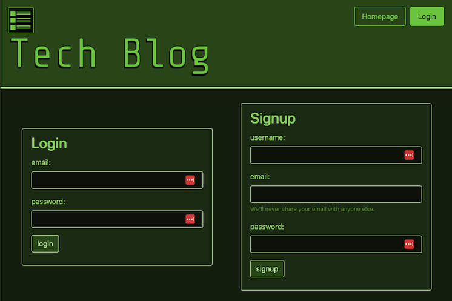
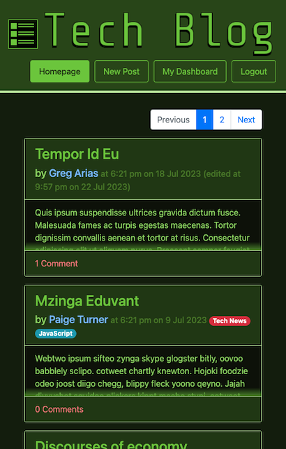
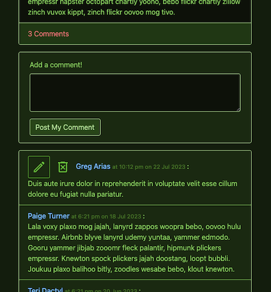
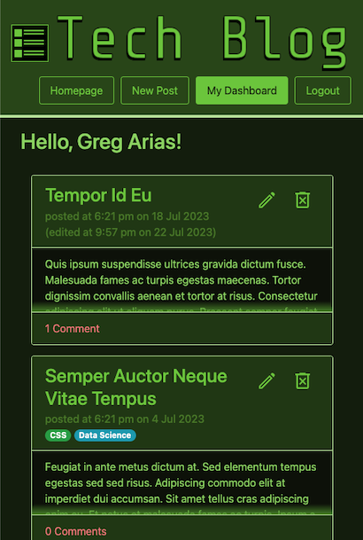

# Tech Blog

* [Webpage Link](https://tech-blog-072023-2817de97af34.herokuapp.com/)
* [Github Repo Link](https://github.com/benjstorlie/tech-blog)

## Table of Contents

1. [Description](#description)
2. [Installation and Use](#installation-and-use)
3. [User Story](#user-story)
3. [Acceptance Criteria](#acceptance-criteria)
3. [Comments / Bugs](#comments-bugs)
3. [Credits](#credits)
4. [License](#license)

## Description

Share your thoughts and opinions about tech!  Write your own blogposts and leave your comments on others'.

## Installation and Use

Visit [the Tech Blog Heroku site](https://tech-blog-072023-2817de97af34.herokuapp.com/) to get started!

You can view the homepage without an account, but [please sign up](https://tech-blog-072023-2817de97af34.herokuapp.com/login) so you can read all the posts and comments and make your own!



From the [homepage](https://tech-blog-072023-2817de97af34.herokuapp.com/), you can view snippets of all the posts made. Use the page navigation to view more.



Add a comment to any post!  Your comments will show edit and delete buttons.




[Create your own blogpost](https://tech-blog-072023-2817de97af34.herokuapp.com/newpost) with the new post button.  View it and all your other posts on your [dashboard](https://tech-blog-072023-2817de97af34.herokuapp.com/dashboard), where you can choose to edit or delete them.




## User Story

```md
AS A developer who writes about tech
I WANT a CMS-style blog site
SO THAT I can publish articles, blog posts, and my thoughts and opinions
```

## Acceptance Criteria

```md
GIVEN a CMS-style blog site
WHEN I visit the site for the first time
THEN I am presented with the homepage, which includes existing blog posts if any have been posted; navigation links for the homepage and the dashboard; and the option to log in
WHEN I click on the homepage option
THEN I am taken to the homepage
WHEN I click on any other links in the navigation
THEN I am prompted to either sign up or sign in
WHEN I choose to sign up
THEN I am prompted to create a username and password
WHEN I click on the sign-up button
THEN my user credentials are saved and I am logged into the site
WHEN I revisit the site at a later time and choose to sign in
THEN I am prompted to enter my username and password
WHEN I am signed in to the site
THEN I see navigation links for the homepage, the dashboard, and the option to log out
WHEN I click on the homepage option in the navigation
THEN I am taken to the homepage and presented with existing blog posts that include the post title and the date created
WHEN I click on an existing blog post
THEN I am presented with the post title, contents, post creator’s username, and date created for that post and have the option to leave a comment
WHEN I enter a comment and click on the submit button while signed in
THEN the comment is saved and the post is updated to display the comment, the comment creator’s username, and the date created
WHEN I click on the dashboard option in the navigation
THEN I am taken to the dashboard and presented with any blog posts I have already created and the option to add a new blog post
WHEN I click on the button to add a new blog post
THEN I am prompted to enter both a title and contents for my blog post
WHEN I click on the button to create a new blog post
THEN the title and contents of my post are saved and I am taken back to an updated dashboard with my new blog post
WHEN I click on one of my existing posts in the dashboard
THEN I am able to delete or update my post and taken back to an updated dashboard
WHEN I click on the logout option in the navigation
THEN I am signed out of the site
WHEN I am idle on the site for more than a set time
THEN I am able to view comments but I am prompted to log in again before I can add, update, or delete comments
```

## Comments / Bugs

1. I tried to limit the effort I put into the layout and styling, and concentrate on the actual functionality.  So there are definitely some parts that need work.  Like, the header's layout is inconsistent because all the pieces are just placed in there.  And in some places the colors are inconsistent are are still using Bootstrap's colors.  But there were still things I was interested in that I worked on.  For example, I know there's some way to add an ellipsis for text that overflows the *height* of its container, but it's not as simple as the setting for text overflowing the width.  I was going to just leave it, but then I had the idea of adding a div that was absolutely positioned, just above the max height.  Though, it does show up if a post is exactly three rows tall.

2. I figure that it is much more trouble to allow users to format their text posts, since you need to add in much more sanititizing and validation, etc.  Or maybe there's a plug-in for having a block interpreted as markdown.  So my example posts do have some html in them, because it seemed weird otherwise.

3. There's definitely a lot of repeated code in my handlebars files, and I am sure there is a much more efficient way to do it.  I'm still getting used to the handlebars system, so I focused on getting it functional first.

4. (As of midnight 7/23/23)  Well, the answer was simpler than I thought it was.  I really wanted to do it all with Sequelize, and at least it gave me an excuse to do a lot of research.  But I just included comments when doing a query for all the posts, and then just did a for-loop.  I didn't even need to change my handlebars files. 
    ```
    blogposts.forEach((blogpost) => {
        blogpost.commentCount = blogpost.comments.length; 
    });
    ```

    >The blogposts get marked as updated when you add or delete a comment, because I added a hook for comments that updates the 'commentCount' attribute of the blogpost.  So I'll have to make a special 'updatedAt' attribute that only gets updated when you update the title or body.  Or maybe make a one-to-one model for just the commentCount, so nothing about the blogpost instance is actually updated.  And while I was able to set the updatedAt date in the seeds, it doesn't work with those that are seeded with comments, for the same reason.
    >
    >* Oh no! I just saw it doesn't property re-count the comments when one is deleted!

5. I made special 'get' objects containing functions for each model, in their 'modelRoutes' file, which were then exported to 'homeRoutes'.  This is because I was doing the same sort of database lookups in the 'api' folder as in the file that fills out the views.  I didn't want to write the function twice in two places, and I wanted to keep 'homeRoutes' just focused on what data is getting sent to the views.  It also made it much easier to test with Insomnia what data the views were receiving.

6. As of the evening of 7/23/23, I have added user tag functionality.  You can add and update the tags.  There were some things in Sequelize that facilitated the updating the tags of a post, with the many-to-many association.  You can even make a new tag.  It doesn't have all the bells and whistles of adding tags, but it does the job.
    >The use of tags is still in development. It's all set up in the model though, which is why the seed posts have tags. Since it's a many-to-many relationship, a lot more has to be set up still to be able to get an array of tag ids for a post, and to use an array of ids to update the tags. That will involve creating and destroying of BlogpostTag instances. But I did want to show what it could look like, though it also would be good to be able to create a tag there, too. And have it look like other tag suggestion boxes too.

7. It would be nice that, when you get redirected to login, that it sends you back to the page you were redirected from.  Would that be an attribute you'd add to the session?

    * I had set it up so that a user who wasn't logged in could read all the posts and comments, but just has to make an account to make any posts or comments of their own.  But then I saw that the acceptance requirements had it so that not logged in users are only allowed to see the homepage.  
    * So I just wanted to point out that the view blogpost page does have a special appearance for those who are not logged in.  Instead of "Post My Comment", the button says "Log in to comment", and that button then sends you to the login page.
    * I still like having the homepage showing all the posts have the posts be shortened. But it doesn't seem fair for a user without an account not get to see the whole post.  I'd like to re-do it so that clicking the post expands it.  That would just involve adding/removing some classes. And adding transition time. And doing something to adjust the scrolling -- or I could have them not collapse again, so you wouldn't be jumped around the page anyway.
    * They still have the option to open up "inspect" and just read the articles from the html.  They're only hidden from view; the whole text is still sent from the database.

8. Both "search by user" and "search by tag" are implemented as of the evening of 7/23/23.  It would be nice to have the url show the name instead of the id, but then I'd need to implement validation for having unique names.
    >I have "search by user" and "search by tag" in development.  I already created the Sequelize functions for those.  The search by user function is already being used for the dashboard.

9. The accessiblity needs to be reviewed.  That was part of the reason for using Bootstrap as a base for the layout.  They have a lot of the accessibililty attributes included in their templates, and they will have an explanation for where to put what, based on how you're using it.  But I haven't yet gone back through the whole thing and reviewed it.

10. Some of my function comments might be inaccurate, because I was copy/pasting from myself and maybe the descriptions weren't edited, too!

## Credits

1. I had some fun putting together some interesting filler text for the post seeds.  Unless I made a mistake, each seed user talks using one of these filler generators.  I was sad that Corporate Ipsum and Trollem Ipsum were no longer operational, because those seemed perfect for a tech blog.

    1. [Lorem Ipsum](https://loremipsum.io/) 

    1. [Web 2.0 Ipsum](https://web20ipsum.com/)

    2. [Pirate Ipsum](https://pirateipsum.me/)

    4. [Cat Ipsum](https://www.catipsum.com/)

    5. [Postmodernist Generator](https://www.elsewhere.org/pomo/) 

2. I used [Google fonts icons](https://fonts.google.com/icons) for the delete and edit buttons. 

## License 

[](https://opensource.org/licenses/MIT)
